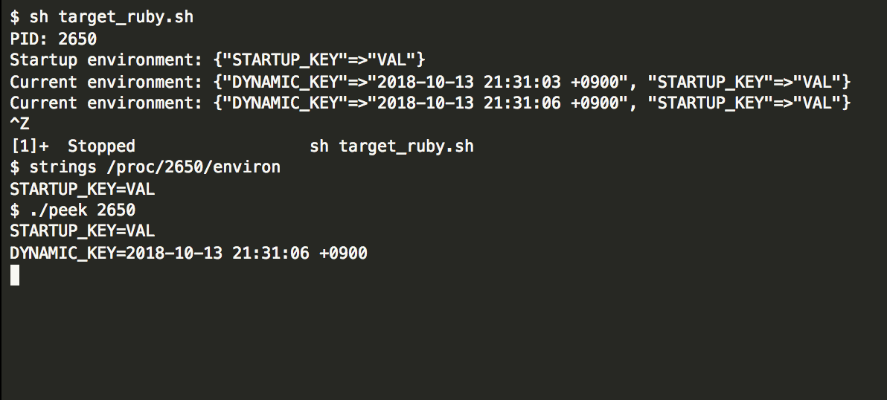

# peke_envs (peek poke environment variables)

## Concepts

* **Experimental purpose**
* Peek(Read) and Poke(Write) **current** environment variables of arbitrary process.

## How it works

* Specify a target process as the tracee by pid.
* Search location for __environ pointer of the tracee.
* Exec Ptrace Attach to the tracee.
* Exec Ptrace Peek/Poke(WIP) and follow pointers.

## License

[MIT](./LICENSE)

## Author

[Satoshi Tajima](https://github.com/s-tajima)

